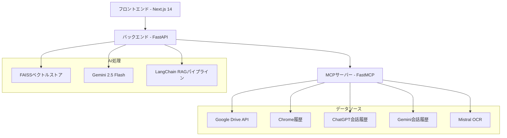

<p align="center">

<br>
</p>

<p align="center">
  <b>AI駆動によるデジタル記憶からの検索・レポート生成</b>
</p>

<p align="right"><small><i>Created by Claude Code (Claude Sonnet 4)</i></small></p>

<p align="center">
  <a href="#-クイックスタート">クイックスタート</a> •
  <a href="#-機能">機能</a> •
  <a href="#-アーキテクチャ">アーキテクチャ</a> •
  <a href="#-インストール">インストール</a> •
  <a href="#-api設定">API設定</a> •
  <a href="#-使用方法">使用方法</a>
</p>

---

## 📖 概要

**Extend Your Memory** は、デジタル知識ソースを包括的で引用付きのレポートに統合するインテリジェント検索・レポート生成システムです。高度なRAG（検索拡張生成）技術とMCP（Model Context Protocol）アーキテクチャを使用して、以下を横断検索します：

- 📁 **Google Drive** の文書、スプレッドシート、PDF
- 🌐 **ブラウザ履歴** Chromeからのコンテンツ取得
- 💬 **ChatGPT会話履歴** 過去のChatGPTとの対話を検索
- 🧠 **Gemini会話履歴** 過去のGeminiとの対話を検索
- 📄 **ウェブページ** PDFのOCR処理付き
- 🤖 **AI分析** Gemini 2.5 Flashを使用

システムは適切な引用、数式サポート（KaTeX）、リアルタイム検索進捗追跡を備えた構造化マークダウンレポートを生成します。

## ✨ 機能

### 🔍 **インテリジェント検索**
- **AGRフレームワーク**: 高度なクエリ分析とキーワード生成
- **階層キーワード**: プライマリ、セカンダリ、コンテキスト、ネガティブキーワード
- **マルチソース統合**: Google Drive、ブラウザ履歴、ChatGPT/Gemini会話履歴の横断検索
- **セマンティック検索**: FAISS駆動のベクトル検索とMMR（最大限界関連性）
- **AI会話統合**: 過去のChatGPTとGeminiとの対話からの知識抽出

### 📊 **スマートレポート生成**
- **構造化出力**: 要約、詳細分析、重要ポイント、結論
- **引用管理**: 番号付き参照の自動URL埋め込み
- **数式サポート**: 数式・公式のKaTeXレンダリング
- **品質フィルタリング**: 低品質ソースと検索結果ページの除去

### 🚀 **リアルタイム体験**
- **WebSocket進捗**: 検索・処理中のライブ更新
- **適応パラメータ**: クエリ複雑度に基づく動的最適化
- **ブラウザ履歴**: 最近の検索のクライアント側保存（最大50会話）

### 🛡️ **セキュリティ・プライバシー**
- **ユーザー管理APIキー**: サーバー側での認証情報保存なし
- **最小権限**: 限定的なGoogle Driveアクセススコープ
- **ローカル処理**: 定期クリーンアップ付きFAISSベクトルストア
- **暗号化ストレージ**: ブラウザlocalStorageでのAPIキー暗号化

## 🏗️ アーキテクチャ



### **技術スタック**

| コンポーネント | 技術 | 目的 |
|-----------|------------|---------|
| **フロントエンド** | Next.js 14 + App Router | リアルタイム更新付きモダンReactインターフェース |
| **バックエンド** | FastAPI + Pydantic v2 | 型安全性を備えた高性能非同期API |
| **MCPサーバー** | FastMCPフレームワーク | ツール統合のためのModel Context Protocol |
| **ベクトルデータベース** | FAISS | ローカルベクトル保存と類似度検索 |
| **LLM** | Gemini 2.5 Flash | クエリ分析とレポート生成 |
| **埋め込み** | Google text-embedding-004 | 文書ベクトル化 |
| **RAGパイプライン** | LangChain | 文書処理と検索 |
| **WebSocket** | FastAPI WebSocket | リアルタイム進捗更新 |

## 🚀 クイックスタート

### 前提条件
- **Docker & Docker Compose** （推奨）
- **Node.js 18+** （ローカル開発用）
- **Python 3.9+** （ローカル開発用）
- **Chrome ブラウザ** （履歴アクセス用）

### 1. リポジトリのクローン
```bash
git clone https://github.com/your-username/ExtendYourMemory.git
cd ExtendYourMemory
```

### 2. 環境設定
```bash
# 環境テンプレートをコピー
cp .env.example .env

# APIキーを編集（下記API設定セクション参照）
nano .env
```

### 3. Dockerで起動
```bash
# 全サービスをビルド・起動
docker compose up --build

# アプリケーションにアクセス
open http://localhost:3000
```

### 4. API設定
1. アプリケーションの設定ページにアクセス
2. APIキー（Google Drive、Mistral OCRなど）を入力
3. デジタル記憶の検索を開始！

## 📋 インストール

### オプション1: Docker Compose（推奨）

```bash
# 1. クローンとナビゲート
git clone https://github.com/your-username/ExtendYourMemory.git
cd ExtendYourMemory

# 2. 環境セットアップ
cp .env.example .env
# .envにAPIキーを記入

# 3. ビルドと実行
docker compose up --build -d

# 4. サービス確認
docker compose ps
```

### オプション2: ローカル開発

#### バックエンドセットアップ
```bash
cd backend

# 仮想環境作成
python -m venv venv
source venv/bin/activate  # Windows: venv\Scripts\activate

# 依存関係インストール
pip install -r requirements.txt

# 環境変数設定
export GOOGLE_API_KEY="your-key"
export MISTRAL_OCR_API_KEY="your-key"
# ... その他のキー

# バックエンド起動
python main.py
```

#### MCPサーバーセットアップ
```bash
cd mcp-server

# 依存関係インストール
pip install -r requirements.txt

# MCPサーバー起動
python server_fastapi.py
```

#### フロントエンドセットアップ
```bash
cd frontend

# 依存関係インストール
npm install

# 開発サーバー起動
npm run dev
```

## 🔑 API設定

### 1. Google Drive API

#### ステップ1: Google Cloudプロジェクト作成
1. [Google Cloud Console](https://console.cloud.google.com/)にアクセス
2. 新しいプロジェクトを作成または既存プロジェクトを選択
3. **Google Drive API**を有効化

#### ステップ2: 認証情報作成
1. **API とサービス > 認証情報**に移動
2. **認証情報を作成 > APIキー**をクリック
3. **重要**: APIキーを制限：
   - **アプリケーションの制限**: HTTPリファラー
   - **APIの制限**: Google Drive APIのみ
   - **許可されたリファラー**: あなたのドメイン（例：`localhost:3000/*`）

#### ステップ3: 権限設定
```bash
# 使用APIスコープ:
# - https://www.googleapis.com/auth/drive.readonly
# - https://www.googleapis.com/auth/drive.metadata.readonly
```

**セキュリティ注意**: このアプリはGoogle Driveへの読み取り専用アクセスを使用します。ファイルの変更、削除、作成はできません。

### 2. Mistral OCR API

#### ステップ1: APIキー取得
1. [Mistral AI Platform](https://console.mistral.ai/)にアクセス
2. アカウント作成またはサインイン
3. **APIキー**セクションに移動
4. 新しいAPIキーを生成

#### ステップ2: 料金情報
- **無料枠**: 月間限定リクエスト
- **従量課金**: 文書処理量ベース
- **レート制限**: ダッシュボードで現在の制限を確認

### 3. Chrome履歴アクセス

#### Chrome拡張機能インストール（推奨）

**必要な手順:**

1. **Chrome拡張機能管理ページを開く**
   ```
   chrome://extensions/
   ```

2. **デベロッパーモードを有効化**
   - ページ右上の「デベロッパーモード」トグルをONにする

3. **拡張機能をロード**
   - 「パッケージ化されていない拡張機能を読み込む」をクリック
   - プロジェクトの`chrome-extension`フォルダを選択

4. **拡張機能の確認**
   - 拡張機能一覧に「Extend Your Memory - Chrome History Bridge」が表示される
   - 拡張機能が有効になっていることを確認

**拡張機能の権限について:**
- **chrome.history**: ブラウザ履歴へのアクセス
- **storage**: 設定の保存
- **alarms**: 定期実行機能
- **idle**: アイドル状態検知

**セキュリティ特徴:**
- 履歴データはローカル処理のみ
- 外部サーバーへの履歴データ送信なし
- ユーザーの明示的な許可が必要
- 最小権限の原則に従った設計

#### オプション: ローカルChromeデータベース
```bash
# ChromeはSQLiteデータベースに履歴を保存
# OS別の場所:

# macOS
~/Library/Application Support/Google/Chrome/Default/History

# Windows
%LOCALAPPDATA%\Google\Chrome\User Data\Default\History

# Linux
~/.config/google-chrome/Default/History
```

**重要**: Chromeデータベースに直接アクセスする場合、Chromeを完全に終了する必要があります。

### 5. ChatGPT・Gemini会話履歴アクセス

**Extend Your Memory**は、ChatGPTとGeminiとの過去の会話履歴を検索対象に含めることができます。Chrome拡張機能を通じて安全にアクセスします。

#### 初回セットアップ手順

1. **Chrome拡張機能がインストールされていることを確認**
   - 上記「Chrome履歴アクセス」セクションの手順に従って拡張機能をインストール

2. **ChatGPTまたはGeminiサイトにアクセス**
   ```
   https://chat.openai.com/    # ChatGPTの場合
   https://gemini.google.com/  # Geminiの場合
   ```

3. **会話履歴の自動収集**
   - 初回アクセス時に拡張機能が自動的に会話履歴を収集します
   - ブラウザコンソールで進捗を確認できます（F12 → Console）

4. **Extend Your Memoryで検索**
   - 通常の検索に過去のAI会話内容が含まれるようになります
   - 「○○について以前ChatGPTに聞いたことは？」などの検索が可能

#### 重要事項
- **プライバシー保護**: 会話内容はローカル処理のみ、外部送信なし
- **自動更新**: サイト訪問時に新しい会話が自動的に追加されます
- **検索統合**: Google DriveやChrome履歴と同時に検索されます

#### 対応状況
- ✅ **ChatGPT** (chat.openai.com, chatgpt.com)
- ✅ **Gemini** (gemini.google.com, bard.google.com)

**使用例**: 「機械学習について過去にAIと議論した内容をまとめて」などの検索で、ChatGPTやGeminiとの過去の対話から関連情報を抽出できます。

### 6. 環境変数

プロジェクトルートに`.env`ファイルを作成：

```bash
# 必須API
GOOGLE_API_KEY=your_google_drive_api_key
MISTRAL_OCR_API_KEY=your_mistral_api_key
GOOGLE_DRIVE_API_KEY=your_google_drive_api_key  # GOOGLE_API_KEYと同じ

# サーバー設定
MCP_SERVER_URL=http://localhost:8501
BACKEND_URL=http://localhost:8000
FRONTEND_URL=http://localhost:3000

# オプション: ログ設定
LOG_LEVEL=INFO
```

## 🖥️ 使用方法

### 基本的な検索フロー

1. **アプリケーション起動**
   ```bash
   docker compose up -d
   ```

2. **ブラウザでアクセス**
   - `http://localhost:3000`に移動
   - 設定でAPIキーを設定

3. **記憶を検索**
   - 自然言語でクエリを入力
   - リアルタイム進捗更新を確認
   - 引用付きレポートを確認

### クエリ例

```
"私が研究した機械学習アルゴリズムについて教えて"
"最近のブラウジングでReactフックについて学んだことは？"
"プロジェクト管理手法に関するメモをまとめて"
"私の文書からPython最適化技術を見つけて"
"以前ChatGPTに質問したデータ分析について教えて"
"Geminiと話した量子コンピューティングの内容をまとめて"
"AIとの過去の対話から機械学習のベストプラクティスを抽出して"
```

### 高度な機能

#### フォルダ除外設定
```json
{
  "excluded_folders": [
    "folder_id_1",
    "folder_id_2"
  ],
  "auto_exclude": true
}
```

#### 検索パラメータ
- **類似度閾値**: 関連性フィルタリングの調整（0.1-0.9）
- **最大結果数**: 処理文書数の制御
- **検索戦略**: 精密検索 vs 探索的検索モード

## 🔧 設定

### バックエンド設定（`backend/config_manager.py`）

```python
# 類似度閾値
DEFAULT_SIMILARITY_THRESHOLD = 0.3
HIGH_QUALITY_THRESHOLD = 0.7

# 文書制限
MAX_DOCUMENTS_FOR_RELEVANCE_CHECK = 15
MAX_RAG_QUERIES = 15

# ベクトルストア設定
VECTOR_CACHE_PATH = "./vector_store_cache"
AUTO_CLEAR_CACHE = True
```

### フロントエンド設定

```typescript
// チャット履歴制限
MAX_CHAT_HISTORY = 50

// WebSocket設定
WEBSOCKET_RECONNECT_DELAY = 1000
MAX_RECONNECT_ATTEMPTS = 3

// APIエンドポイント
BACKEND_API = process.env.NEXT_PUBLIC_BACKEND_URL || 'http://localhost:8000'
```

## 🧪 開発

### テスト実行
```bash
# バックエンドテスト
cd backend
pytest tests/

# フロントエンドテスト
cd frontend
npm test

# 統合テスト
docker compose -f docker compose.test.yml up
```

### コード品質
```bash
# バックエンドリント
cd backend
ruff check .
black .
mypy .

# フロントエンドリント
cd frontend
npm run lint
npm run type-check
```

### デバッグモード
```bash
# デバッグログを有効化
export LOG_LEVEL=DEBUG

# ホットリロード付きで起動
docker compose -f docker compose.dev.yml up
```

## 📊 モニタリング

### アプリケーションメトリクス
- 検索応答時間
- 文書処理統計
- API使用量追跡
- エラー率とタイプ

### ベクトルストア統計
```python
# ベクトルストアヘルス確認
GET /api/vector-store/status

# レスポンス
{
  "documents_count": 150,
  "last_updated": "2024-01-15T10:30:00Z",
  "cache_size_mb": 25.4,
  "index_type": "FAISS"
}
```

## 🚀 デプロイメント

### 本番Docker設定
```bash
# 本番用composeファイルを使用
docker compose -f docker compose.prod.yml up -d

# リバースプロキシ付き（nginx）
docker compose -f docker compose.prod.yml -f docker compose.nginx.yml up -d
```

### 環境別設定
```bash
# 本番環境
NODE_ENV=production
FASTAPI_ENV=production
LOG_LEVEL=INFO
ENABLE_CORS=false

# ステージング環境
NODE_ENV=staging
DEBUG=false
LOG_LEVEL=DEBUG
```

### ヘルスチェック
```bash
# バックエンドヘルス
curl http://localhost:8000/health

# MCPサーバーヘルス
curl http://localhost:8501/health

# フロントエンドヘルス
curl http://localhost:3000/api/health
```

## 🔒 セキュリティ

### APIキー管理
- **APIキーをコミットしない**（バージョン管理）
- すべての秘密情報に**環境変数を使用**
- **定期的なキーローテーション**
- 異常な**API使用量の監視**

### データプライバシー
- 個人コンテンツの**サーバー側データ永続化なし**
- 自動クリーンアップ付き**ローカルベクトル保存**
- APIキーの**暗号化ブラウザ保存**
- 外部サービスへの**読み取り専用アクセス**

### ネットワークセキュリティ
```bash
# 本番用ファイアウォールルール
ufw allow 80    # HTTP
ufw allow 443   # HTTPS
ufw deny 8000   # バックエンド直接アクセスをブロック
ufw deny 8501   # MCP直接アクセスをブロック
```

## 🤝 貢献

### 開発ワークフロー
1. リポジトリをフォーク
2. 機能ブランチ作成: `git checkout -b feature/amazing-feature`
3. 変更を加えて十分にテスト
4. 従来のコミット: `feat: add amazing feature`
5. プッシュしてプルリクエスト作成

### コード標準
- **バックエンド**: PEP 8準拠、型ヒント使用
- **フロントエンド**: TypeScript使用、ESLintルール準拠
- **ドキュメント**: 新機能はREADME更新
- **テスト**: 80%以上のテストカバレッジ維持

## 📄 ライセンス

このプロジェクトはMITライセンスの下で公開されています - 詳細は[LICENSE](LICENSE)ファイルを参照してください。

## 🆘 トラブルシューティング

### よくある問題

#### "Google Drive APIキーが無効"
```bash
# APIキー制限を確認
# Google Cloud ConsoleでAPI有効化を確認
# 適切なリファラー制限を確認
```

#### "Chrome履歴アクセス拒否"
```bash
# Chromeを完全に終了
# ファイル権限を確認
# Chrome拡張機能がインストールされているか確認
```

#### "ベクトルストアキャッシュエラー"
```bash
# キャッシュディレクトリをクリア
rm -rf backend/vector_store_cache/

# アプリケーション再起動
docker compose restart
```

#### "MCPサーバー接続失敗"
```bash
# MCPサーバーログを確認
docker compose logs mcp-server

# ポート8501が利用可能か確認
netstat -tulpn | grep 8501
```

### デバッグコマンド
```bash
# 全ログを表示
docker compose logs -f

# バックエンドのみ
docker compose logs -f backend

# サービスヘルス確認
docker compose ps
```

### パフォーマンス問題
- **類似度閾値を下げる**（高速検索のため）
- **最大文書数を制限**（大データセット用）
- **ベクトルキャッシュをクリア**（メモリ使用量が高い場合）
- **APIレート制限を監視**
