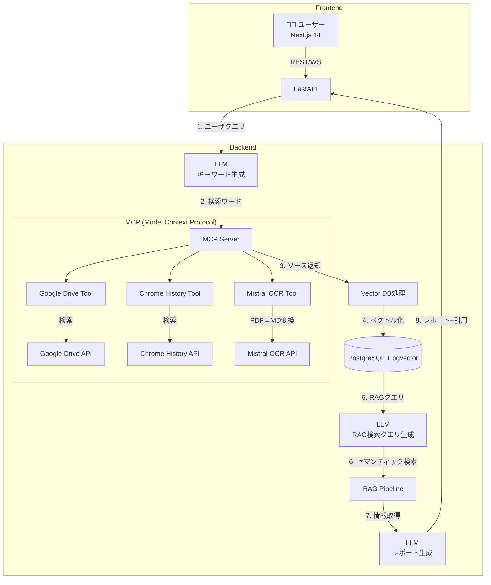
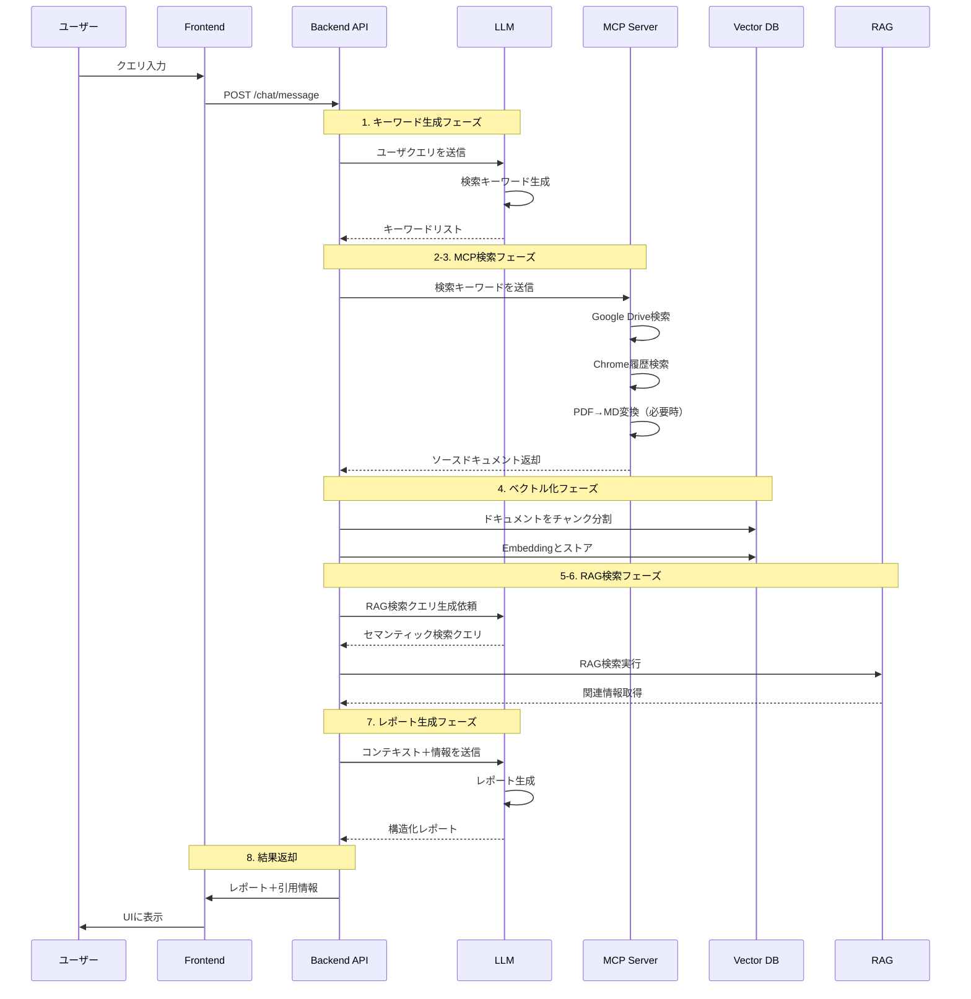

# AIエージェント Web アプリケーション技術定義書  
**（MCP アーキテクチャ版 / ドキュメント Version 3.0）**

最終更新日: 2025-06-02  

---

## 1. プロジェクト概要

### 1.1. プロジェクト名
**Extend Your Memory**

### 1.2. 目的
ユーザーが過去に閲覧・保存した **Google Drive ファイル・ブラウザ履歴・Web ページ** を一括検索し、引用付きレポートを自動生成する個人向け AI アプリケーションを構築する。

### 1.3. コアバリュー
- 「これどこかで見た気がするなぁ．．．」を解消
- ユーザーが過去にアクセスした複数の情報源から自動的に情報を統合
- 適切な引用を含む構造化されたレポートを生成
- 手動での情報収集とレポート作成にかかる時間を大幅に削減

---

## 2. システムアーキテクチャ（MCP版）



## 3. 処理フロー詳細

### 3.1. 全体の処理フロー



### 3.2. MCP（Model Context Protocol）の役割

MCPは、LLMとの対話を通じて外部ツールへのアクセスを仲介するプロトコルです。本システムでは以下のツールを提供：

#### 3.2.1. Google Drive Tool
```python
@mcp_tool
async def search_google_drive(
    keywords: List[str],
    file_types: Optional[List[str]] = None,
    folder_id: Optional[str] = "root"
) -> List[Document]:
    """Google Driveからキーワードに基づいてファイルを検索"""
    # Drive API を使用した検索実装
    # PDFファイルは自動的にOCR Toolに転送
```

#### 3.2.2. Chrome History Tool
```python
@mcp_tool
async def search_chrome_history(
    keywords: List[str],
    date_range: Optional[DateRange] = None
) -> List[HistoryItem]:
    """Chrome履歴からキーワードに基づいて検索"""
    # Chrome History APIを使用した検索実装
```

#### 3.2.3. Mistral OCR Tool
```python
@mcp_tool
async def ocr_pdf_to_markdown(
    file_path: str,
    language: str = "ja"
) -> str:
    """PDFファイルをMistral OCRでMarkdown変換"""
    # Mistral OCR APIを使用した変換実装
```

## 4. 技術スタック（MCP対応版）

| 層 | ライブラリ／サービス | 備考 |
|----|--------------------|------|
| **LLM** | Gemini 2.5 flash | メインLLM |
| **MCP実装** | `langchain-mcp-adapters` | LangChain公式MCP統合 |
| **MCPツール** | カスタム実装 | Google Drive, Chrome, OCR |
| **LangChain** | `langchain==0.3.*` | RAGパイプライン用 |
| **Vector DB** | `FAISS` | 高速ベクトル検索 |
| **Embedding** | `models/embedding-004` (Google) | 最新の多言語対応 |
| **バックエンド** | FastAPI + Pydantic v2 | |
| **フロントエンド** | Next.js 14 (App Router) | |

## 5. MCP サーバー実装

### 5.1. LangChain MCP Adapter による実装

```python
from langchain_mcp_adapters.client import MultiServerMCPClient
from langchain_mcp_adapters.tools import load_mcp_tools
from mcp.server.fastmcp import FastMCP

# MCPサーバーの定義
class ExtendMemoryMCPServer:
    """Extend Your Memory用のMCPサーバー実装"""
    
    def __init__(self):
        self.mcp = FastMCP("ExtendMemory")
        self.register_tools()
    
    def register_tools(self):
        """利用可能なツールを登録"""
        
        @self.mcp.tool()
        async def search_google_drive(
            keywords: List[str],
            file_types: Optional[List[str]] = None,
            folder_id: Optional[str] = "root"
        ) -> List[Dict[str, Any]]:
            """Google Driveからキーワードに基づいてファイルを検索"""
            # Google Drive APIを使用した検索実装
            from langchain_google_community import GoogleDriveLoader
            
            loader = GoogleDriveLoader(
                folder_id=folder_id,
                file_types=file_types or ["document", "sheet", "pdf"],
                recursive=True,
                num_results=50,
                load_auth=True  # 権限情報も読み込み
            )
            
            # キーワードフィルタリング
            documents = []
            for doc in loader.load():
                if any(keyword.lower() in doc.page_content.lower() for keyword in keywords):
                    documents.append({
                        "content": doc.page_content,
                        "metadata": doc.metadata,
                        "file_id": doc.metadata.get("id"),
                        "title": doc.metadata.get("title"),
                        "mime_type": doc.metadata.get("mimeType")
                    })
            
            return documents
        
        @self.mcp.tool()
        async def search_chrome_history(
            keywords: List[str],
            days: int = 30
        ) -> List[Dict[str, Any]]:
            """Chrome履歴からキーワードに基づいて検索"""
            # AsyncChromiumLoaderを使用したブラウザ履歴取得
            from langchain_community.document_loaders import AsyncChromiumLoader
            
            # Chrome履歴データベースへのアクセス（ユーザー許可必要）
            history_items = []
            # 実装詳細...
            
            return history_items
        
        @self.mcp.tool()
        async def ocr_pdf_to_markdown(
            file_content: bytes,
            file_name: str
        ) -> str:
            """PDFファイルをMistral OCRでMarkdown変換"""
            from mistralai import Mistral
            
            client = Mistral(api_key=os.getenv("MISTRAL_API_KEY"))
            
            # Mistral OCR APIを使用
            response = client.ocr.process(
                file_content=file_content,
                file_name=file_name,
                format="markdown"
            )
            
            return response.text

### 5.2. LangChain統合クライアント

```python
# MCPクライアントの初期化
mcp_client = MultiServerMCPClient({
    "extend_memory": {
        "command": "python",
        "args": ["./mcp_server.py"],
        "transport": "stdio"
    }
})

# LangChainツールとして使用
tools = await mcp_client.get_tools()
```

## 6. RAGパイプライン実装（MCP統合版）

```python
from langchain.chains import create_retrieval_chain
from langchain.schema.runnable import RunnableParallel, RunnablePassthrough
from langchain.prompts import PromptTemplate
from langchain.chat_models import init_chat_model
from langchain_google_genai import GoogleGenerativeAIEmbeddings
from langchain_community.vectorstores import FAISS
from langchain_text_splitters import MarkdownHeaderTextSplitter, RecursiveCharacterTextSplitter
from langchain_mcp_adapters.client import MultiServerMCPClient

# 1. キーワード生成チェーン
keyword_prompt = PromptTemplate(
    template="""ユーザーからの質問: {question}

この質問に関連する情報を検索するため、以下の観点から検索キーワードを生成してください：
1. 質問の核心的なトピック
2. 関連する技術用語（日本語・英語両方）
3. 類似概念や同義語
4. 時期やバージョンに関する情報

JSON形式で5-10個のキーワードを出力してください。
出力形式: {"keywords": ["キーワード1", "keyword2", ...]}"""
)

model = init_chat_model("gemini-2.5-flash", model_provider="google_genai")
keyword_chain = keyword_prompt | model

# 2. MCP統合設定
mcp_client = MultiServerMCPClient({
    "extend_memory": {
        "command": "python",
        "args": ["./mcp_server.py"],
        "transport": "stdio"
    }
})

async def search_with_mcp(keywords: List[str]) -> List[Document]:
    """MCPを使用してドキュメントを検索"""
    tools = await mcp_client.get_tools()
    
    # search_google_driveツールを実行
    gdrive_tool = next(t for t in tools if t.name == "search_google_drive")
    gdrive_results = await gdrive_tool.ainvoke({"keywords": keywords})
    
    # search_chrome_historyツールを実行
    chrome_tool = next(t for t in tools if t.name == "search_chrome_history")
    chrome_results = await chrome_tool.ainvoke({"keywords": keywords})
    
    # 結果を統合
    all_documents = gdrive_results + chrome_results
    
    # PDFファイルのOCR処理
    ocr_tool = next(t for t in tools if t.name == "ocr_pdf_to_markdown")
    for doc in all_documents:
        if doc.metadata.get("mime_type") == "application/pdf":
            ocr_result = await ocr_tool.ainvoke({
                "file_content": doc.page_content,
                "file_name": doc.metadata.get("title")
            })
            doc.page_content = ocr_result
            doc.metadata["ocr_processed"] = True
    
    return all_documents

# 3. テキスト分割設定
def split_documents(documents: List[Document]) -> List[Document]:
    """ドキュメントを適切なチャンクに分割"""
    all_splits = []
    
    for doc in documents:
        if doc.metadata.get("ocr_processed") or ".md" in doc.metadata.get("title", ""):
            # Markdownドキュメントの場合
            headers_to_split_on = [
                ("#", "Header 1"),
                ("##", "Header 2"),
                ("###", "Header 3")
            ]
            markdown_splitter = MarkdownHeaderTextSplitter(
                headers_to_split_on=headers_to_split_on,
                strip_headers=False
            )
            md_splits = markdown_splitter.split_text(doc.page_content)
            
            # さらに文字数で分割
            text_splitter = RecursiveCharacterTextSplitter(
                chunk_size=1000,
                chunk_overlap=200
            )
            for split in md_splits:
                chunks = text_splitter.split_documents([split])
                all_splits.extend(chunks)
        else:
            # 通常のテキストドキュメント
            text_splitter = RecursiveCharacterTextSplitter(
                chunk_size=1000,
                chunk_overlap=200,
                separators=["\n\n", "\n", "。", ".", " ", ""]
            )
            chunks = text_splitter.split_documents([doc])
            all_splits.extend(chunks)
    
    return all_splits

# 4. ベクトル化とストア
embedding = GoogleGenerativeAIEmbeddings(
    model="models/embedding-004",
    google_api_key=os.getenv("GOOGLE_API_KEY")
)

# FAISSベクトルストアの初期化
vector_store = None

async def process_and_store_documents(documents: List[Document]) -> FAISS:
    """ドキュメントを処理してベクトルストアに保存"""
    global vector_store
    
    # ドキュメントを分割
    splits = split_documents(documents)
    
    # ベクトル化とストア
    if vector_store is None:
        vector_store = FAISS.from_documents(
            documents=splits,
            embedding=embedding
        )
    else:
        vector_store.add_documents(splits)
    
    return vector_store

# 5. RAG検索クエリ生成
rag_query_prompt = PromptTemplate(
    template="""元の質問: {original_question}
取得したドキュメントの要約: {doc_summary}

上記の情報を基に、より詳細な情報を取得するためのセマンティック検索クエリを生成してください。
以下の観点を含めてください：
1. 質問の本質的な意図
2. ドキュメントから得られた新しい視点
3. 関連する概念の深堀り

5-10個の検索クエリをJSON形式で出力してください。
出力形式: {"queries": ["クエリ1", "クエリ2", ...]}"""
)

rag_query_chain = rag_query_prompt | model

# 6. 完全なRAGパイプライン
async def full_rag_pipeline(user_query: str) -> Dict[str, Any]:
    """完全なRAG処理パイプライン"""
    
    # ステップ1: キーワード生成
    keywords_response = await keyword_chain.ainvoke({"question": user_query})
    keywords = json.loads(keywords_response.content)
    
    # ステップ2-3: MCP検索
    documents = await search_with_mcp(keywords["keywords"])
    
    # ステップ4: ベクトル化とストア
    vector_store = await process_and_store_documents(documents)
    
    # ドキュメントの要約生成
    doc_summary = "\n".join([doc.page_content[:200] for doc in documents[:5]])
    
    # ステップ5: RAG検索クエリ生成
    rag_queries_response = await rag_query_chain.ainvoke({
        "original_question": user_query,
        "doc_summary": doc_summary
    })
    rag_queries = json.loads(rag_queries_response.content)
    
    # ステップ6: セマンティック検索（FAISS使用）
    relevant_docs = []
    for query in rag_queries["queries"]:
        # FAISSのMMR（Maximal Marginal Relevance）検索を使用
        docs = vector_store.max_marginal_relevance_search(
            query, 
            k=3,
            fetch_k=10,
            lambda_mult=0.5
        )
        relevant_docs.extend(docs)
    
    # 重複除去
    unique_docs = {doc.metadata.get("file_id", doc.page_content[:50]): doc 
                   for doc in relevant_docs}.values()
    
    # ステップ7: レポート生成
    report_prompt = PromptTemplate(
        template="""質問: {question}

以下の情報源を基に、構造化されたレポートを作成してください：

{context}

レポートには以下を含めてください：
1. 要約（Executive Summary）
2. 詳細な分析
3. 重要なポイント
4. 引用情報（各情報には必ず出典を明記）

マークダウン形式で出力してください。"""
    )
    
    context = "\n---\n".join([
        f"出典: {doc.metadata}\n内容: {doc.page_content}"
        for doc in list(unique_docs)[:10]  # 最大10ドキュメントまで
    ])
    
    report_chain = report_prompt | model
    report = await report_chain.ainvoke({
        "question": user_query,
        "context": context
    })
    
    # ベクトルストアをローカルに保存（オプション）
    vector_store.save_local("./vector_store_cache")
    
    return {
        "report": report.content,
        "sources": [doc.metadata for doc in unique_docs],
        "keywords_used": keywords["keywords"],
        "rag_queries": rag_queries["queries"],
        "total_documents": len(documents),
        "relevant_documents": len(list(unique_docs))
    }
```

## 7. API設計（MCP対応版）

### 7.1. WebSocket イベント（検索プロセス可視化）

```python
# ステップ1: キーワード生成
{
    "event": "search_progress",
    "data": {
        "step": 1,
        "stage": "keyword_generation",
        "message": "検索キーワードを生成中...",
        "details": {
            "query": "LLMの最新技術動向について"
        }
    }
}

# ステップ2-3: MCP検索
{
    "event": "search_progress", 
    "data": {
        "step": 2,
        "stage": "mcp_search",
        "message": "MCPサーバーでソースを検索中...",
        "details": {
            "keywords": ["LLM", "大規模言語モデル", "Transformer"],
            "searching": ["google_drive", "chrome_history"]
        }
    }
}

# ステップ4: ベクトル化
{
    "event": "search_progress",
    "data": {
        "step": 4,
        "stage": "vectorization",
        "message": "取得したドキュメントをベクトル化中...",
        "details": {
            "total_documents": 25,
            "processed": 15,
            "sources": {
                "google_drive": 12,
                "chrome_history": 13
            }
        }
    }
}

# ステップ5-6: RAG検索
{
    "event": "search_progress",
    "data": {
        "step": 5,
        "stage": "rag_search",
        "message": "セマンティック検索を実行中...",
        "details": {
            "rag_queries": [
                "最新のLLMアーキテクチャとその特徴",
                "Transformerモデルの効率化手法",
                "日本語LLMの開発動向"
            ]
        }
    }
}

# ステップ7: レポート生成
{
    "event": "search_progress",
    "data": {
        "step": 7,
        "stage": "report_generation",
        "message": "レポートを生成中...",
        "details": {
            "relevant_sources": 8,
            "citations_count": 15
        }
    }
}
```

## 8. 環境構築とデプロイ

### 8.1. Docker構成

```yaml
# docker-compose.yml
version: '3.9'

services:
  # MCPサーバー
  mcp-server:
    build: ./mcp-server
    environment:
      - GOOGLE_DRIVE_API_KEY=${GOOGLE_DRIVE_API_KEY}
      - CHROME_API_KEY=${CHROME_API_KEY}
      - MISTRAL_OCR_API_KEY=${MISTRAL_OCR_API_KEY}
    ports:
      - "8501:8501"
    volumes:
      - ./mcp-tools:/app/tools
  
  # バックエンドAPI
  backend:
    build: ./backend
    environment:
      - MCP_SERVER_URL=http://mcp-server:8501
    ports:
      - "8000:8000"
    depends_on:
      - mcp-server
  
  # フロントエンド
  frontend:
    build: ./frontend
    ports:
      - "3000:3000"
    environment:
      - NEXT_PUBLIC_API_URL=http://localhost:8000
```

## 9. セキュリティとプライバシー

### 9.1. API キー管理
- 各ユーザーが自分のAPIキーを設定
- キーは暗号化してローカルストレージに保存
- サーバー側では一時的にメモリ上でのみ保持

### 9.2. データプライバシー
- Chrome履歴へのアクセスは明示的な許可が必要
- Google Driveのアクセススコープは最小限に設定
- ベクトルDBのデータは定期的に削除可能

## 10. 今後の拡張計画

1. **MCPツールの追加**
   - Slack検索ツール
   - Notion検索ツール
   - ローカルファイル検索ツール

2. **LLMの最適化**
   - ローカルLLMオプションの追加
   - ファインチューニングによる検索精度向上

3. **UI/UXの改善**
   - 検索結果のインタラクティブな可視化
   - レポートのリアルタイム共同編集

